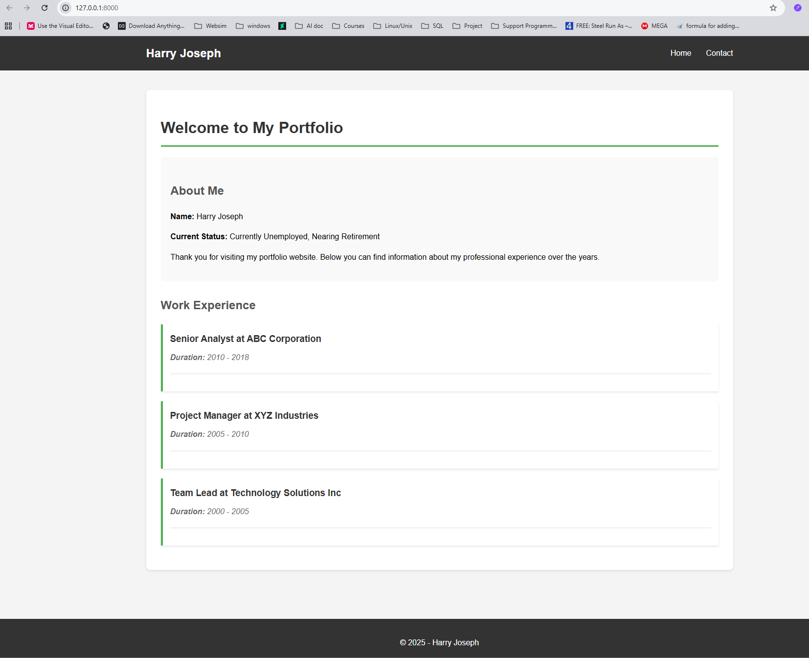
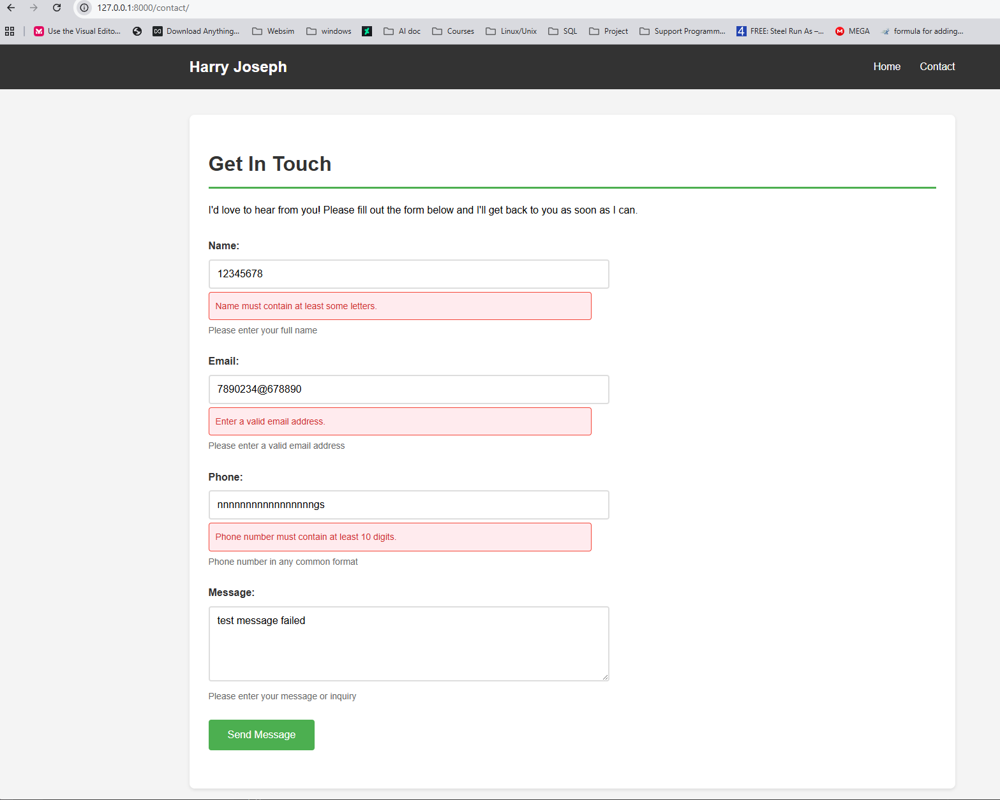
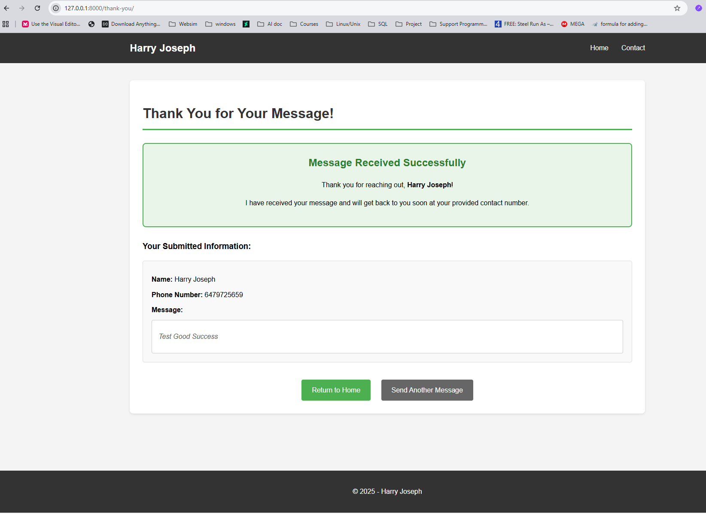
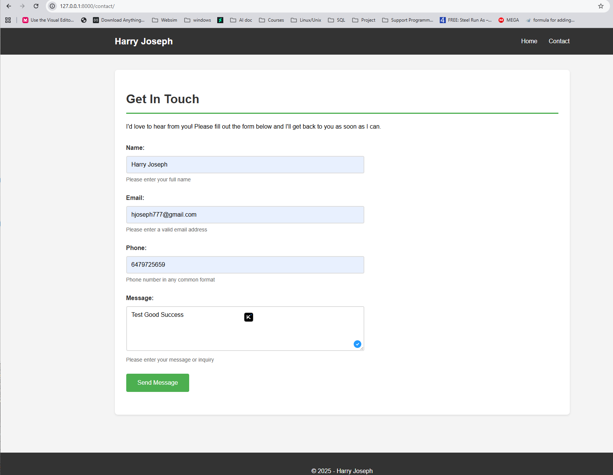
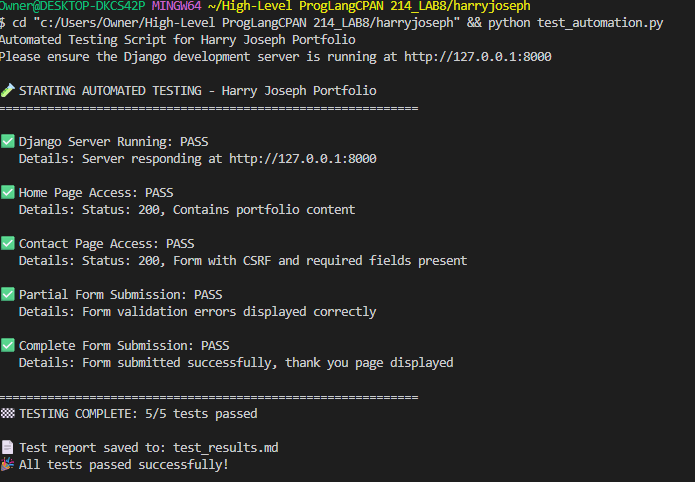

## Harry Joseph Portfolio - Django Web Application

## Project Metadata
- Author: High-Level Programming Languages CPAN 214
- Created: November 17, 2025
- Platform: Django Web Framework (Python)
- Package Manager: pip
- Framework: Django 5.2.8
- Database: SQLite (default)
- Routing: URL-based routing

## Overview
Harry Joseph Portfolio is a comprehensive Django web application showcasing professional portfolio information with interactive contact functionality. The project demonstrates Django best practices including template inheritance, form handling, validation, and responsive design.

## Quick Download

**Get the complete project instantly:**

 

 

*Complete Django project with portfolio display and contact form ready to run*

## Live Demo

**Experience the portfolio in action:**

*Interactive Django web application - Start the development server to view*

## Application Demo & Screenshots

### Visual Application Walkthrough

Experience the Harry Joseph Portfolio through these comprehensive screenshots showcasing all key features and functionality:

#### 1. **Portfolio Home Page**

 <i>Professional portfolio homepage displaying work experience and navigation</i>

---

#### 2. **Contact Form Interface**

 <i>Interactive contact form with validation and professional styling</i>

---

#### 3. **Form Validation in Action** 

 <i>Real-time form validation showing error messages and user feedback</i>

---

#### 4. **Successful Form Submission**

 <i>Thank you page displaying submitted contact information confirmation</i>

---

#### 5. **Automated Testing Results**

 <i>Complete automated testing suite showing all 5 tests passing successfully</i>

### Key Features Demonstrated
- **Professional Portfolio Layout** - Clean, responsive design
- **Secure Form Handling** - CSRF protection and validation
- **Real-time Validation** - Instant feedback for user inputs
- **User Experience** - Smooth navigation and feedback
- **Quality Assurance** - Comprehensive automated testing

## Important: Where your main Django code lives
- The main views logic is in [`harryjoseph/portfolio/views.py`](harryjoseph/portfolio/views.py) with home, contact, and thank you views
- The Django forms are in [`harryjoseph/portfolio/forms.py`](harryjoseph/portfolio/forms.py) with contact form validation
- Templates are in [`harryjoseph/portfolio/templates/portfolio/`](harryjoseph/portfolio/templates/portfolio/) with base, home, contact, and thank you templates

## Project Explorer
An interactive, collapsible view of the Django codebase. Click file names to open them.

   
<strong>harryjoseph/ – Main Project Directory</strong>

   - **harryjoseph**
      - [`__init__.py`](harryjoseph/harryjoseph/__init__.py) – Package marker
      - [`settings.py`](harryjoseph/harryjoseph/settings.py) – **Django configuration & settings**
      - [`urls.py`](harryjoseph/harryjoseph/urls.py) – **Main URL routing**
      - [`wsgi.py`](harryjoseph/harryjoseph/wsgi.py) – WSGI application entry point
      - [`asgi.py`](harryjoseph/harryjoseph/asgi.py) – ASGI application entry point

   
<strong>portfolio/ – Portfolio Django App</strong>

   - **portfolio**
      - [`__init__.py`](harryjoseph/portfolio/__init__.py) – Package marker
      - [`views.py`](harryjoseph/portfolio/views.py) – **Main view functions (home, contact, thank you)**
      - [`forms.py`](harryjoseph/portfolio/forms.py) – **Django forms with validation**
      - [`urls.py`](harryjoseph/portfolio/urls.py) – **App-specific URL routing**
      - [`apps.py`](harryjoseph/portfolio/apps.py) – App configuration
      - [`admin.py`](harryjoseph/portfolio/admin.py) – Admin interface config
      - [`models.py`](harryjoseph/portfolio/models.py) – Database models (empty)
      - [`tests.py`](harryjoseph/portfolio/tests.py) – Test cases
      - **templates/portfolio/**
         - [`base.html`](harryjoseph/portfolio/templates/portfolio/base.html) – **Base template with navigation**
         - [`home.html`](harryjoseph/portfolio/templates/portfolio/home.html) – **Portfolio/home page**
         - [`contact.html`](harryjoseph/portfolio/templates/portfolio/contact.html) – **Contact form page**
         - [`thank_you.html`](harryjoseph/portfolio/templates/portfolio/thank_you.html) – **Form success page**

   
<strong>Database & Management</strong>

   - [`db.sqlite3`](harryjoseph/db.sqlite3) – SQLite database (auto-generated)
   - [`manage.py`](harryjoseph/manage.py) – **Django management script**
   - [`README.md`](README.md) – Documentation (this file)

*This project demonstrates modern Django web development techniques with proper form handling, validation, and template inheritance.*
